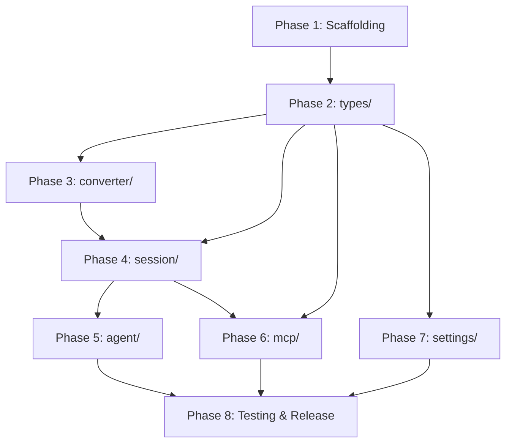

# Claude Code ACP Agent (Rust) Development Plan

## Overview

This document provides a detailed development plan based on the technical design in `claude-code-acp-spec.md`.

**Goal**: Implement a Rust ACP (Agent Client Protocol) agent so that Zed and other ACP-compatible editors can use Claude Code.

**Project characteristics**:
- Single-crate structure to make publishing to crates.io easier
- Support Meta fields (`systemPrompt`, `resume` session_id)
- Support configuring alternative model endpoints via environment variables

---

## Phase 1: Project scaffolding

### 1.1 Project initialization

**Task list**:

- [ ] 1.1.1 Create `Cargo.toml`
  - Configure package metadata (name, description, keywords, categories)
  - Configure bin and lib targets
  - Add all dependencies

- [ ] 1.1.2 Create `src/main.rs` CLI entry
  - Basic logging initialization (tracing-subscriber)
  - Call `claude_code_acp::run_acp()`

- [ ] 1.1.3 Create `src/lib.rs` library entry
  - Module declarations
  - Public API exports

- [ ] 1.1.4 Configure `rust-toolchain.toml`
  - Use Rust Edition 2024
  - Configure nightly channel (if needed for edition 2024)

- [ ] 1.1.5 Configure `.gitignore` and `rustfmt.toml`

### 1.2 Create module skeletons

Create modules in dependency order:

- [ ] 1.2.1 Create `src/types/` shared types module
  ```
  src/types/
  ├── mod.rs
  ├── error.rs        # AgentError definition
  ├── config.rs       # AgentConfig definition
  ├── meta.rs         # NewSessionMeta, SystemPromptMeta, ClaudeCodeMeta
  ├── session.rs      # TokenUsage, SessionStats, etc.
  ├── tool.rs         # ToolInfo, ToolKind, etc.
  └── notification.rs
  ```

- [ ] 1.2.2 Create `src/converter/` message conversion module
  ```
  src/converter/
  ├── mod.rs
  ├── prompt.rs       # ACP → SDK conversion
  ├── notification.rs # SDK → ACP conversion
  └── tool.rs         # Tool metadata extraction
  ```

- [ ] 1.2.3 Create `src/settings/` settings management module
  ```
  src/settings/
  ├── mod.rs
  └── manager.rs
  ```

- [ ] 1.2.4 Create `src/session/` session management module
  ```
  src/session/
  ├── mod.rs
  ├── manager.rs      # SessionManager
  ├── state.rs        # Session state
  ├── permission.rs   # PermissionHandler
  └── usage.rs        # UsageTracker
  ```

- [ ] 1.2.5 Create `src/mcp/` MCP server module
  ```
  src/mcp/
  ├── mod.rs
  ├── server.rs
  └── tools/
      ├── mod.rs
      ├── read.rs
      ├── write.rs
      ├── edit.rs
      └── bash.rs
  ```

- [ ] 1.2.6 Create `src/agent/` agent core module
  ```
  src/agent/
  ├── mod.rs
  ├── core.rs         # ClaudeAcpAgent
  ├── handlers.rs     # ACP request handlers
  └── runner.rs       # run_acp()
  ```

- [ ] 1.2.7 Create `src/util/` utilities module

### 1.3 Build verification

- [ ] 1.3.1 Ensure `cargo build` succeeds
- [ ] 1.3.2 Ensure `cargo test` passes (empty tests)
- [ ] 1.3.3 Ensure `cargo clippy` has no warnings

---

## Phase 2: Shared types implementation (types/)

### 2.1 Error types

- [ ] 2.1.1 Implement `AgentError` enum
  - SessionNotFound
  - AuthRequired
  - InvalidMode
  - ToolExecutionFailed
  - ClaudeSdkError
  - IoError
  - JsonError
  - Internal

- [ ] 2.1.2 Implement `From<AgentError> for sacp::RequestError`

### 2.2 Configuration types

- [ ] 2.2.1 Implement `AgentConfig`
  - `base_url: Option<String>`
  - `auth_token: Option<String>`
  - `model: Option<String>`
  - `small_fast_model: Option<String>`

- [ ] 2.2.2 Implement `AgentConfig::from_env()`
  - Read `ANTHROPIC_BASE_URL`
  - Read `ANTHROPIC_AUTH_TOKEN`
  - Read `ANTHROPIC_MODEL`
  - Read `ANTHROPIC_SMALL_FAST_MODEL`

- [ ] 2.2.3 Implement `AgentConfig::apply_to_options()`

### 2.3 Meta field types (new)

- [ ] 2.3.1 Implement `SystemPromptMeta` struct
  - `append: Option<String>` - append to system prompt
  - `replace: Option<String>` - replace system prompt
  - `from_meta()` parse helper

- [ ] 2.3.2 Implement `ClaudeCodeMeta` struct
  - `options: Option<ClaudeCodeOptions>`
  - `from_meta()` parse helper
  - `get_resume_session_id()` helper

- [ ] 2.3.3 Implement `ClaudeCodeOptions` struct
  - `resume: Option<String>` - session id to resume

- [ ] 2.3.4 Implement `NewSessionMeta` struct
  - `system_prompt: Option<SystemPromptMeta>`
  - `claude_code: Option<ClaudeCodeMeta>`
  - `from_request_meta()` unified parse helper
  - `get_system_prompt_append()` helper
  - `get_resume_session_id()` helper

### 2.4 Session types

- [ ] 2.4.1 Implement `TokenUsage` struct
  - `input_tokens: u64`
  - `output_tokens: u64`
  - `cache_read_input_tokens: Option<u64>`
  - `cache_creation_input_tokens: Option<u64>`

- [ ] 2.4.2 Implement `TokenUsage::from_sdk_usage()`
- [ ] 2.4.3 Implement `TokenUsage::add()`
- [ ] 2.4.4 Implement `SessionStats` struct

### 2.5 Tool types

- [ ] 2.5.1 Implement `ToolKind` enum
- [ ] 2.5.2 Implement `ToolInfo` struct
- [ ] 2.5.3 Implement `ToolCallLocation` struct
- [ ] 2.5.4 Implement `ToolUseEntry` and `ToolUseType`

### 2.6 Unit tests

- [ ] 2.6.1 `AgentConfig::from_env()` tests
- [ ] 2.6.2 `NewSessionMeta::from_request_meta()` tests
- [ ] 2.6.3 `TokenUsage` serialization/deserialization tests
- [ ] 2.6.4 Error conversion tests

---

## Phase 3: Message conversion implementation (converter/)

### 3.1 Prompt conversion (ACP → SDK)

- [ ] 3.1.1 Implement `PromptConverter` struct
- [ ] 3.1.2 Implement `convert_text_chunk()` - text chunk conversion
- [ ] 3.1.3 Implement `convert_resource_link()` - resource link conversion
- [ ] 3.1.4 Implement `convert_resource()` - embedded resource conversion
- [ ] 3.1.5 Implement `convert_image()` - image → `UserContentBlock::image_*`

### 3.2 Notification conversion (SDK → ACP)

- [ ] 3.2.1 Implement `NotificationConverter` struct
- [ ] 3.2.2 Implement `convert_message()` - main entry
- [ ] 3.2.3 Implement `convert_assistant_message()` - ContentBlock conversion
- [ ] 3.2.4 Implement `convert_stream_event()` - delta event conversion
- [ ] 3.2.5 Implement notification builders:
  - `make_agent_message_notification()`
  - `make_agent_message_chunk_notification()`
  - `make_agent_thought_notification()`
  - `make_agent_thought_chunk_notification()`
  - `make_tool_call_notification()`
  - `make_tool_result_notification()`

### 3.3 Tool metadata extraction

- [ ] 3.3.1 Implement `extract_tool_info()` - extract UI-friendly metadata from tool name + input
- [ ] 3.3.2 Supported tool types:
  - Read/Write/Edit → ToolKind::Read/Edit
  - Bash → ToolKind::Execute
  - Grep/Glob → ToolKind::Search
  - WebFetch → ToolKind::Fetch

### 3.4 Unit tests

- [ ] 3.4.1 Text conversion tests
- [ ] 3.4.2 Image conversion tests
- [ ] 3.4.3 Tool-call notification tests
- [ ] 3.4.4 Streaming event conversion tests

---

## Phase 4: Session management implementation (session/)

### 4.1 UsageTracker implementation

- [ ] 4.1.1 Implement `UsageTracker` struct
  - `total_usage: RwLock<TokenUsage>`
  - `total_cost_usd: AtomicU64`

- [ ] 4.1.2 Implement `update_from_result()` - update from ResultMessage
- [ ] 4.1.3 Implement `get_usage()` and `get_cost_usd()`

### 4.2 PermissionHandler implementation

- [ ] 4.2.1 Implement `PermissionHandler` struct
  - `pending_requests: DashMap<String, PendingPermissionRequest>`
  - `notifier: Arc<dyn AcpNotifier>`

- [ ] 4.2.2 Implement `PendingPermissionRequest` struct
- [ ] 4.2.3 Implement `create_can_use_tool_callback()` - create SDK permission callback
- [ ] 4.2.4 Implement `handle_permission_response()` - handle ACP client responses
- [ ] 4.2.5 Implement `acp_mode_to_sdk_mode()` and `sdk_mode_to_acp_mode()`

### 4.3 Session implementation

- [ ] 4.3.1 Implement `Session` struct
  - `client: ClaudeClient`
  - `cancelled: AtomicBool`
  - `permission_mode: RwLock<SdkPermissionMode>`
  - `usage_tracker: UsageTracker`
  - `converter: NotificationConverter`
  - `system_prompt_append: Option<String>` (new: from meta)

- [ ] 4.3.2 Implement `Session::new()` - create session and connect ClaudeClient
  - Support `meta.systemPrompt.append` appending a system prompt
  - Support `meta.claudeCode.options.resume` resuming a session

- [ ] 4.3.3 Implement `Session::prompt()` - send content and return a message stream
- [ ] 4.3.4 Implement `Session::prompt_text()` - send a text prompt
- [ ] 4.3.5 Implement `Session::interrupt()` - interrupt current execution
- [ ] 4.3.6 Implement `Session::set_permission_mode()` - set permission mode
- [ ] 4.3.7 Implement `Session::set_model()` - switch model dynamically
- [ ] 4.3.8 Implement `Session::process_response_stream()` - process response stream
- [ ] 4.3.9 Implement `Session::disconnect()` - disconnect

### 4.4 SessionManager implementation

- [ ] 4.4.1 Implement `SessionManager` struct
  - `sessions: DashMap<String, Arc<RwLock<Session>>>`
  - `config: AgentConfig`
  - `permission_handler: Arc<PermissionHandler>`

- [ ] 4.4.2 Implement `create_session()` - create a new session
  - Accept `NewSessionMeta` to handle systemPrompt and resume

- [ ] 4.4.3 Implement `get_session()` - fetch a session
- [ ] 4.4.4 Implement `remove_session()` - remove and disconnect a session
- [ ] 4.4.5 Implement `get_session_stats()` - fetch stats

### 4.5 Unit tests

- [ ] 4.5.1 UsageTracker update tests
- [ ] 4.5.2 Permission mode conversion tests
- [ ] 4.5.3 SessionManager concurrency tests
- [ ] 4.5.4 Meta parsing and session creation tests

---

## Phase 5: Agent core implementation (agent/)

### 5.1 ClaudeAcpAgent structure

- [ ] 5.1.1 Implement `ClaudeAcpAgent` struct
  - `session_manager: SessionManager`
  - `config: AgentConfig`
  - `permission_handler: Arc<PermissionHandler>`

- [ ] 5.1.2 Implement `ClaudeAcpAgent::new()`

### 5.2 ACP request handlers

- [ ] 5.2.1 Implement `initialize()` handler
  - Return agent capability info
  - Set client capabilities

- [ ] 5.2.2 Implement `authenticate()` handler (optional)

- [ ] 5.2.3 Implement `new_session()` handler
  - Parse `_meta` into `NewSessionMeta`
  - Handle `systemPrompt` append
  - Handle `claudeCode.options.resume` resume
  - Call `SessionManager::create_session()`
  - Return session_id and supported_modes

- [ ] 5.2.4 Implement `load_session()` handler
  - Also support `_meta` parsing

- [ ] 5.2.5 Implement `prompt()` handler
  - Fetch session
  - Convert ACP content to SDK `UserContentBlock`
  - Call `session.prompt()`
  - Process response stream and send notifications
  - Return `PromptResponse`

- [ ] 5.2.6 Implement `cancel()` handler
  - Call `session.interrupt()`

- [ ] 5.2.7 Implement `set_session_mode()` handler
  - Call `session.set_permission_mode()`

### 5.3 ACP notification sending

- [ ] 5.3.1 Implement `AcpNotifier` trait
- [ ] 5.3.2 Implement notification sending via `JrHandlerChain`

### 5.4 Agent runner

- [ ] 5.4.1 Implement `run_acp()`
  - Load env configuration
  - Create ClaudeAcpAgent
  - Build JrHandlerChain
  - Register all request handlers
  - Start ByteStreams service

### 5.5 Integration tests

- [ ] 5.5.1 initialize request test
- [ ] 5.5.2 new_session request test (including meta)
- [ ] 5.5.3 prompt request test
- [ ] 5.5.4 cancel request test
- [ ] 5.5.5 set_mode request test

---

## Phase 6: MCP Server implementation (mcp/)

### 6.1 MCP server basics

- [ ] 6.1.1 Integrate `rmcp`
- [ ] 6.1.2 Implement `McpServer` struct
- [ ] 6.1.3 Implement `McpTool` trait

### 6.2 Built-in tools

- [ ] 6.2.1 Implement `ReadTool`
  - Inputs: `file_path`, `offset`, `limit`
  - Output: file content

- [ ] 6.2.2 Implement `WriteTool`
  - Inputs: `file_path`, `content`
  - Output: write status

- [ ] 6.2.3 Implement `EditTool`
  - Inputs: `file_path`, `old_string`, `new_string`, `replace_all`
  - Output: edit result

- [ ] 6.2.4 Implement `BashTool`
  - Inputs: `command`, `description`, `timeout`
  - Output: command result

- [ ] 6.2.5 Implement `KillShellTool`
- [ ] 6.2.6 Implement `BashOutputTool`

### 6.3 Tool integration

- [ ] 6.3.1 Register tools with the MCP server
- [ ] 6.3.2 Implement tool permission checks

### 6.4 Unit tests

- [ ] 6.4.1 Read tool tests
- [ ] 6.4.2 Write tool tests
- [ ] 6.4.3 Edit tool tests
- [ ] 6.4.4 Bash tool tests

---

## Phase 7: Settings management implementation (settings/)

### 7.1 SettingsManager

- [ ] 7.1.1 Implement `SettingsManager` struct
- [ ] 7.1.2 Implement settings file loading
  - User settings: `~/.claude/settings.json`
  - Project settings: `.claude/settings.json`
  - Local settings: `.claude/settings.local.json`

- [ ] 7.1.3 Implement settings merging logic (priority: Local > Project > User)

---

## Phase 8: Testing, documentation, and release

### 8.1 Unit test improvements

- [ ] 8.1.1 Reach 80% coverage for core modules
- [ ] 8.1.2 Add boundary-condition tests
- [ ] 8.1.3 Add error-handling tests

### 8.2 Integration tests

- [ ] 8.2.1 Full session flow test
- [ ] 8.2.2 Multi-session concurrency tests
- [ ] 8.2.3 Permission request/response tests
- [ ] 8.2.4 Token usage accounting tests
- [ ] 8.2.5 Meta fields end-to-end tests

### 8.3 E2E tests

- [ ] 8.3.1 Integration tests with Zed
- [ ] 8.3.2 Env var configuration tests
- [ ] 8.3.3 Error recovery tests
- [ ] 8.3.4 Session resume tests

### 8.4 Documentation

- [ ] 8.4.1 API documentation (rustdoc)
- [ ] 8.4.2 README.md usage guide
- [ ] 8.4.3 Environment variable configuration guide
- [ ] 8.4.4 Meta fields guide
- [ ] 8.4.5 CHANGELOG.md

### 8.5 Release preparation

- [ ] 8.5.1 Update Cargo.toml version
- [ ] 8.5.2 Ensure dependencies are publishable (vendors → crates.io/git)
- [ ] 8.5.3 Run `cargo publish --dry-run`
- [ ] 8.5.4 Publish with `cargo publish`

---

## Milestones

### M1: Scaffolding complete
- Phase 1 complete
- All modules compile
- Dependencies are correct

### M2: Core types ready
- Phase 2 complete
- All types in types/ are available (including Meta types)
- Unit tests pass

### M3: Message conversion working
- Phase 3 complete
- ACP ↔ SDK message conversion works
- Unit tests pass

### M4: Session management working
- Phase 4 complete
- Session create/query/destroy works
- Permission handling works
- Token usage accounting works
- Meta parsing works

### M5: Agent MVP
- Phase 5 complete
- Basic ACP protocol support
- Can do basic editor interactions
- Supports systemPrompt and resume

### M6: Feature complete
- Phases 6 and 7 complete
- MCP built-in tools available
- Settings management available

### M7: Release-ready
- Phase 8 complete
- Test coverage meets target
- Documentation complete
- Successfully published to crates.io

---

## Dependency graph



---

## Risks and mitigations

### Risk 1: SDK compatibility
- **Description**: `claude-agent-sdk-rs` updates may introduce breaking changes
- **Mitigation**: Pin versions via git submodules; review updates regularly

### Risk 2: ACP protocol changes
- **Description**: ACP may introduce breaking changes
- **Mitigation**: Track updates in the agent-client-protocol repo and keep in sync

### Risk 3: Concurrency issues
- **Description**: Incorrect DashMap usage can lead to deadlocks
- **Mitigation**: Use entry APIs and avoid nested locking

### Risk 4: Environment variable safety
- **Description**: Leakage of sensitive info like AUTH_TOKEN
- **Mitigation**: Never log sensitive values

### Risk 5: crates.io publish dependencies
- **Description**: `vendors/` dependencies cannot be used directly when publishing to crates.io
- **Mitigation**: Switch to crates.io or git dependencies before release (or wait for upstream releases)

---

## Appendix

### A. Development environment requirements

- Rust: nightly (for edition 2024)
- Dependencies:
  - tokio
  - serde / serde_json
  - dashmap
  - thiserror / anyhow
  - tracing / tracing-subscriber
  - uuid
  - futures
  - rmcp

### B. Test commands

```bash
# Run all tests
cargo test

# Run module-specific tests
cargo test types::
cargo test session::
cargo test agent::

# Run integration tests
cargo test --test integration

# Lint/style checks
cargo clippy
cargo fmt --check
```

### C. Build commands

```bash
# Debug build
cargo build

# Release build
cargo build --release

# Install locally
cargo install --path .

# Publish to crates.io
cargo publish --dry-run
cargo publish
```

### D. Meta field examples

**Append systemPrompt**:

```json
{
  "_meta": {
    "systemPrompt": {
      "append": "Please respond in English"
    }
  }
}
```

**Resume session**:

```json
{
  "_meta": {
    "claudeCode": {
      "options": {
        "resume": "session-uuid-12345"
      }
    }
  }
}
```

**Combined**:

```json
{
  "_meta": {
    "systemPrompt": {
      "append": "Please respond in English"
    },
    "claudeCode": {
      "options": {
        "resume": "session-uuid-12345"
      }
    }
  }
}
```
