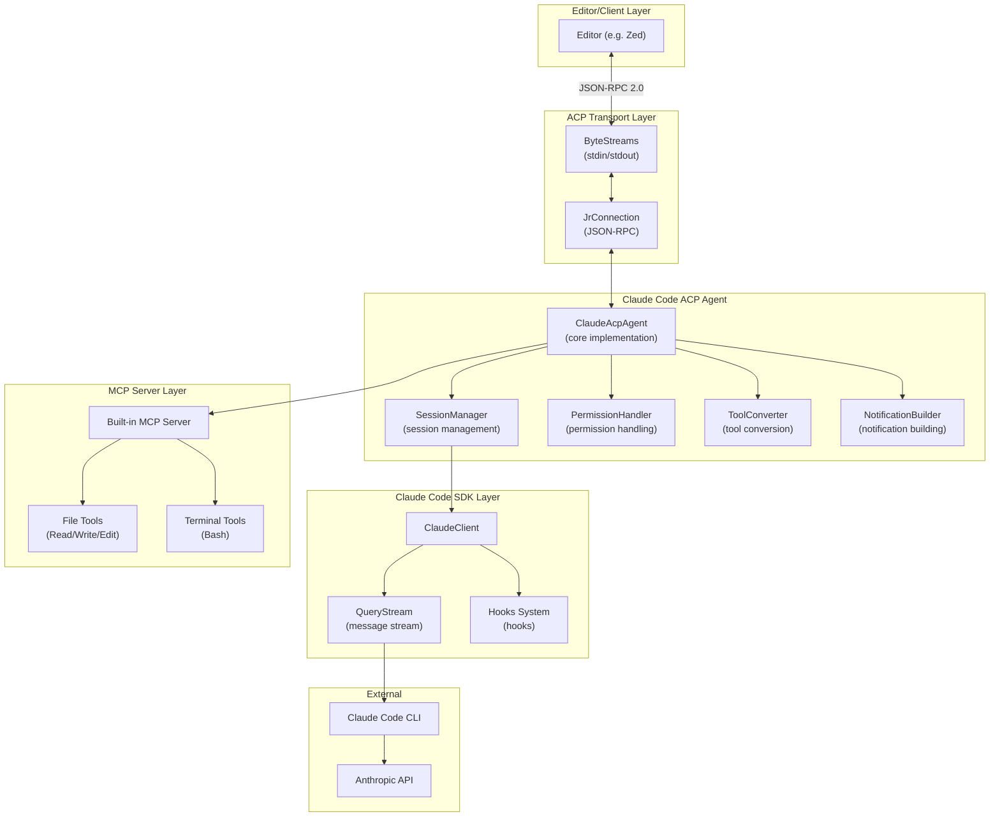
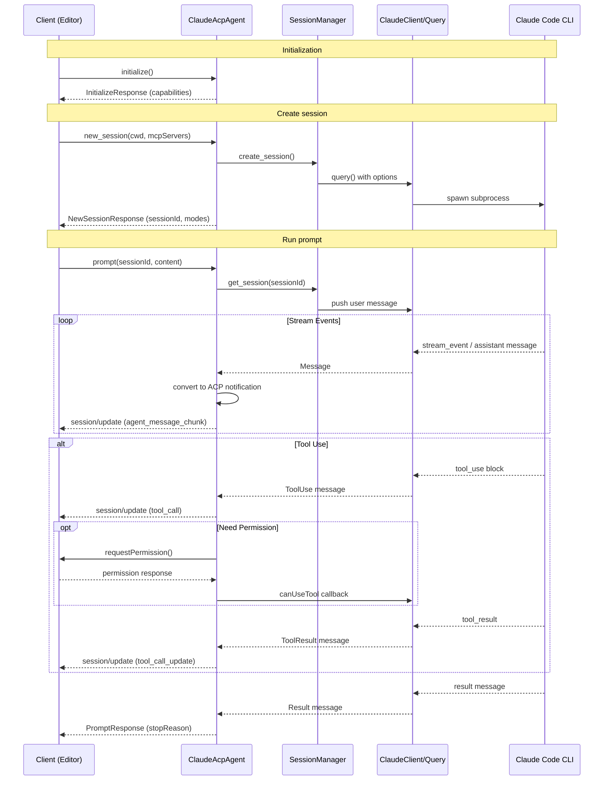
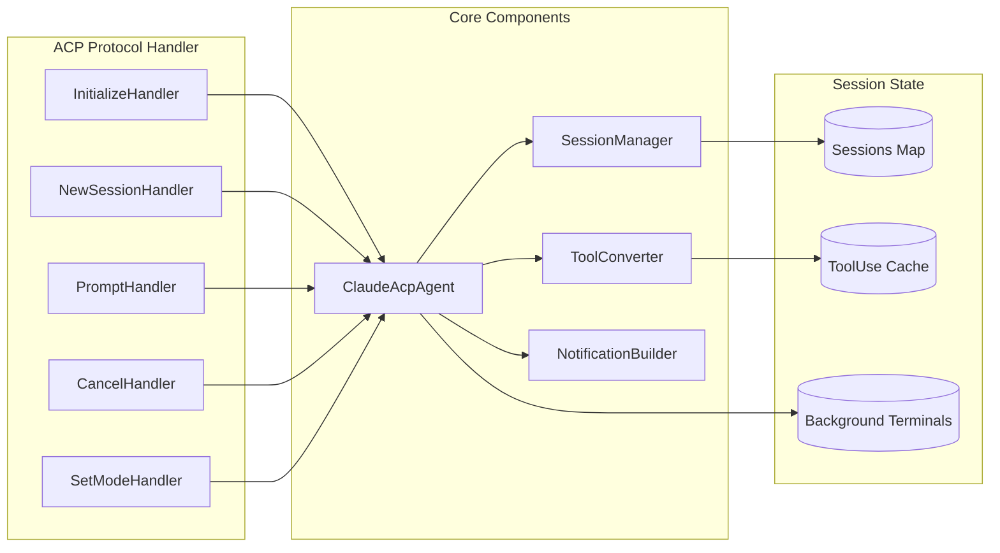
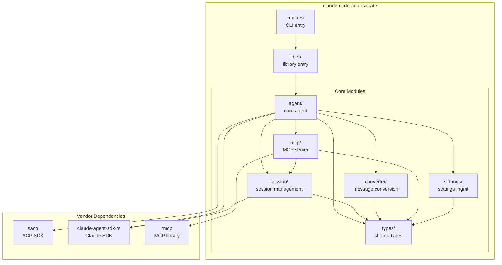
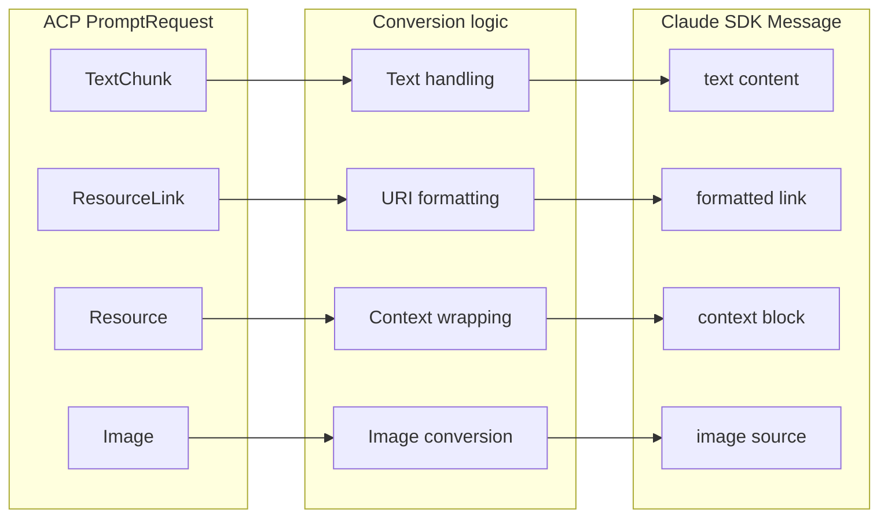
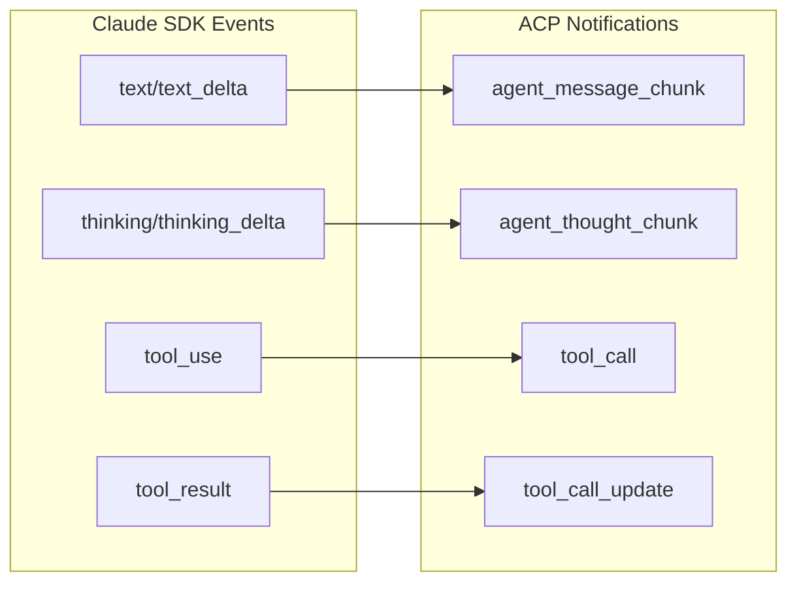
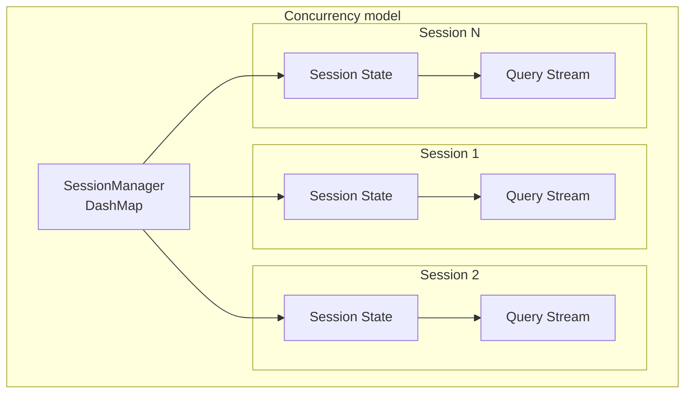
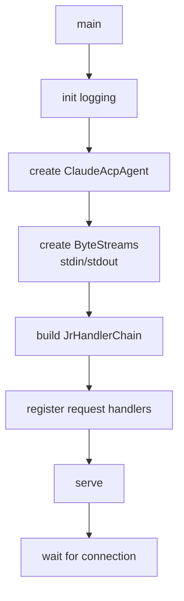

# Claude Code ACP Agent (Rust) Technical Design

## 1. Overview

### 1.1 Project goal

Implement a Claude Code Agent in Rust that speaks ACP (Agent Client Protocol) so that any ACP-compatible editor (e.g. Zed) can use Claude Code.

### 1.2 Reference projects

| Project | Location | Purpose |
|--------|----------|---------|
| claude-code-acp (TypeScript) | `vendors/claude-code-acp` | Primary reference implementation |
| acp-rust-sdk (SACP) | `vendors/acp-rust-sdk` | ACP protocol Rust SDK |
| claude-agent-sdk-rs | `vendors/claude-agent-sdk-rs` | Claude Code SDK for Rust |
| agent-client-protocol | `vendors/agent-client-protocol` | ACP schema definitions |

### 1.3 Design principles

- Rust Edition 2024
- Use `tokio` as the async runtime
- Follow SOLID principles
- Follow "Fail Fast" principles
- Use `dashmap` for concurrent map operations
- **Single-crate structure**: publish as a single crate on crates.io for easy consumption
- **Centralized dependency management**: use `[workspace.dependencies]` in the root Cargo.toml to manage dependency versions

### 1.4 Requirements

#### 1.4.1 Environment variable configuration

Support configuring the model via environment variables to make it easy to use alternative endpoints (e.g. domestic proxies):

| Environment variable | Description | Required |
|---------------------|-------------|----------|
| `ANTHROPIC_BASE_URL` | API base URL | No |
| `ANTHROPIC_AUTH_TOKEN` | Auth token | No |
| `ANTHROPIC_MODEL` | Primary model name | No |
| `ANTHROPIC_SMALL_FAST_MODEL` | Small/fast model name | No |

#### 1.4.2 Token usage accounting

- Read cumulative token usage from `ResultMessage.usage`
- Read total cost from `ResultMessage.total_cost_usd`
- Read per-call usage from `AssistantMessage.message.usage`
- Aggregate usage statistics at session end

#### 1.4.3 MCP library choice

- Use `rmcp` as the MCP protocol implementation (instead of sacp-rmcp)
- Reference the integration style in `vendors/acp-rust-sdk/src/sacp-rmcp`

#### 1.4.4 Meta field support

In ACP `new_session` and `load_session` requests, the `_meta` field carries additional configuration:

**1. System prompt (systemPrompt)**

Allow clients to append or replace the system prompt via meta:

```rust
/// System prompt structure in meta
/// meta._meta.systemPrompt.append = "custom system prompt"
#[derive(Debug, Clone, Serialize, Deserialize)]
pub struct SystemPromptMeta {
    /// Content appended to the end of the system prompt
    pub append: Option<String>,
    /// Replace the entire system prompt (higher priority than append)
    pub replace: Option<String>,
}

impl SystemPromptMeta {
    /// Parse system prompt configuration from meta JSON
    pub fn from_meta(meta: &serde_json::Value) -> Option<Self> {
        meta.get("systemPrompt")
            .and_then(|v| serde_json::from_value(v.clone()).ok())
    }
}
```

**2. Resume session (resume session_id)**

Allow clients to resume a previous session:

```rust
/// Claude Code options structure in meta
/// meta._meta.claudeCode.options.resume = "session-uuid"
#[derive(Debug, Clone, Serialize, Deserialize)]
pub struct ClaudeCodeMeta {
    pub options: Option<ClaudeCodeOptions>,
}

#[derive(Debug, Clone, Serialize, Deserialize)]
pub struct ClaudeCodeOptions {
    /// Session ID to resume
    pub resume: Option<String>,
}

impl ClaudeCodeMeta {
    /// Parse Claude Code configuration from meta JSON
    pub fn from_meta(meta: &serde_json::Value) -> Option<Self> {
        meta.get("claudeCode")
            .and_then(|v| serde_json::from_value(v.clone()).ok())
    }

    /// Get the session ID to resume
    pub fn get_resume_session_id(&self) -> Option<&str> {
        self.options.as_ref()?.resume.as_deref()
    }
}
```

**3. Meta parser**

Unified meta parsing:

```rust
/// New session meta configuration
pub struct NewSessionMeta {
    /// System prompt configuration
    pub system_prompt: Option<SystemPromptMeta>,
    /// Claude Code-specific configuration
    pub claude_code: Option<ClaudeCodeMeta>,
}

impl NewSessionMeta {
    /// Parse from the ACP request _meta field
    pub fn from_request_meta(meta: Option<&serde_json::Value>) -> Self {
        let meta = match meta {
            Some(m) => m,
            None => return Self::default(),
        };

        Self {
            system_prompt: SystemPromptMeta::from_meta(meta),
            claude_code: ClaudeCodeMeta::from_meta(meta),
        }
    }

    /// Get the system prompt append
    pub fn get_system_prompt_append(&self) -> Option<&str> {
        self.system_prompt.as_ref()?.append.as_deref()
    }

    /// Get the session ID to resume
    pub fn get_resume_session_id(&self) -> Option<&str> {
        self.claude_code.as_ref()?.get_resume_session_id()
    }
}

impl Default for NewSessionMeta {
    fn default() -> Self {
        Self {
            system_prompt: None,
            claude_code: None,
        }
    }
}
```

### 1.5 Claude SDK integration summary

Based on `claude-agent-sdk-rs`, we will use these core interfaces:

#### 1.5.1 Core API selection

| Scenario | Recommended API | Notes |
|----------|------------------|-------|
| Session management | `ClaudeClient` | Bidirectional streaming, dynamic control, multi-session |
| One-off queries | `query()` / `query_stream()` | For simple scenarios |
| Permission control | `can_use_tool` callback | Intercept tool calls to decide permissions |
| Tool hooks | `Hooks` | PreToolUse/PostToolUse hooks |
| Built-in tools | `tool!` macro + `McpServerConfig::Sdk` | Define built-in MCP tools |

#### 1.5.2 Key type mapping

| SDK type | ACP usage |
|---------|-----------|
| `ClaudeClient` | One instance per ACP session |
| `ClaudeAgentOptions` | Session creation configuration |
| `Message` | Convert into ACP SessionNotification |
| `ResultMessage` | Token usage and cost |
| `PermissionMode` | Map to ACP session mode |
| `HookInput::PreToolUse` | Intercept permissions via hooks |

---

## 2. High-level architecture

### 2.1 Overall architecture diagram



### 2.2 Message flow



### 2.3 Component interaction



---

## 3. Core module design

### 3.1 Project layout

This project is published as a single crate on crates.io. Internally, code is organized into modules.

```
claude-code-acp-rs/
├── Cargo.toml                    # main config (includes workspace.dependencies)
├── Cargo.lock
├── src/
│   ├── main.rs                   # CLI entry
│   ├── lib.rs                    # library entry, exports public API
│   │
│   ├── agent/                    # agent core module
│   │   ├── mod.rs
│   │   ├── core.rs               # ClaudeAcpAgent
│   │   ├── handlers.rs           # ACP request handlers
│   │   └── runner.rs             # service bootstrap
│   │
│   ├── session/                  # session management
│   │   ├── mod.rs
│   │   ├── manager.rs            # SessionManager
│   │   ├── state.rs              # session state
│   │   ├── permission.rs         # permission handling
│   │   └── usage.rs              # token usage accounting
│   │
│   ├── converter/                # message conversion
│   │   ├── mod.rs
│   │   ├── prompt.rs             # ACP → Claude SDK
│   │   ├── notification.rs       # Claude SDK → ACP
│   │   └── tool.rs               # tool metadata conversion
│   │
│   ├── mcp/                      # built-in MCP server (rmcp)
│   │   ├── mod.rs
│   │   ├── server.rs             # MCP server implementation
│   │   └── tools/
│   │       ├── mod.rs
│   │       ├── read.rs           # Read tool
│   │       ├── write.rs          # Write tool
│   │       ├── edit.rs           # Edit tool
│   │       └── bash.rs           # Bash tool
│   │
│   ├── settings/                 # settings management
│   │   ├── mod.rs
│   │   └── manager.rs            # SettingsManager
│   │
│   ├── types/                    # shared types
│   │   ├── mod.rs
│   │   ├── config.rs             # AgentConfig, env var config
│   │   ├── meta.rs               # NewSessionMeta, SystemPromptMeta, etc.
│   │   ├── session.rs            # TokenUsage, SessionStats, etc.
│   │   ├── tool.rs               # ToolInfo, ToolKind, etc.
│   │   ├── notification.rs       # notification types
│   │   └── error.rs              # AgentError
│   │
│   └── util/                     # utilities
│       └── mod.rs
│
├── vendors/                      # external dependencies (git submodules)
│   ├── acp-rust-sdk/
│   ├── claude-agent-sdk-rs/
│   ├── claude-code-acp/
│   └── agent-client-protocol/
│
└── specs/                        # design docs
    └── claude-code-acp/
```

### 3.2 Module dependency diagram



### 3.3 Module responsibilities

| Module | Responsibility | Key dependencies |
|--------|----------------|------------------|
| `agent` | Core agent logic, ACP request handling, service bootstrap | sacp, claude-agent-sdk-rs, session, converter, mcp |
| `session` | Session creation/management/state, permission handling, token usage accounting | claude-agent-sdk-rs, types |
| `converter` | ACP ↔ Claude SDK message format conversion | types |
| `mcp` | Built-in MCP server and tools | rmcp, types, session |
| `settings` | User settings loading and management | types |
| `types` | Shared types, errors, configs, meta parsing, constants | serde, thiserror |

### 3.4 Public API exports (lib.rs)

```rust
//! Claude Code ACP Agent
//!
//! A Rust implementation of a Claude Code agent that speaks ACP,
//! enabling any ACP-compatible editor to use Claude Code.
//!
//! ## Quick start
//!
//! ```no_run
//! use claude_code_acp::run_acp;
//!
//! #[tokio::main]
//! async fn main() -> anyhow::Result<()> {
//!     run_acp().await
//! }
//! ```
//!
//! ## Environment variables
//!
//! - `ANTHROPIC_BASE_URL`: API base URL
//! - `ANTHROPIC_AUTH_TOKEN`: auth token
//! - `ANTHROPIC_MODEL`: primary model name
//! - `ANTHROPIC_SMALL_FAST_MODEL`: small/fast model name

pub mod agent;
pub mod converter;
pub mod mcp;
pub mod session;
pub mod settings;
pub mod types;

// Re-exports for convenience
pub use agent::run_acp;
pub use types::{AgentConfig, AgentError, NewSessionMeta};
```

---

## 4. Core interface design

### 4.1 Agent trait

The agent must implement all required ACP protocol methods:

```rust
/// Core ACP agent interface
/// Reference: request/response types in sacp::schema
pub trait AcpAgentHandler {
    /// Initialize the agent and return capabilities
    async fn initialize(&self, request: InitializeRequest) -> Result<InitializeResponse>;

    /// Authenticate (optional)
    async fn authenticate(&self, request: AuthenticateRequest) -> Result<AuthenticateResponse>;

    /// Create a new session
    async fn new_session(&self, request: NewSessionRequest) -> Result<NewSessionResponse>;

    /// Execute a prompt
    async fn prompt(&self, request: PromptRequest) -> Result<PromptResponse>;

    /// Cancel current operation
    async fn cancel(&self, notification: CancelNotification) -> Result<()>;

    /// Set session mode
    async fn set_session_mode(&self, request: SetSessionModeRequest) -> Result<SetSessionModeResponse>;

    // Unstable APIs
    async fn fork_session(&self, request: ForkSessionRequest) -> Result<ForkSessionResponse>;
    async fn resume_session(&self, request: ResumeSessionRequest) -> Result<ResumeSessionResponse>;
}
```

### 4.2 Environment variable config

```rust
/// Agent configuration loaded from environment variables
#[derive(Debug, Clone, Default)]
pub struct AgentConfig {
    /// Anthropic API base URL
    pub base_url: Option<String>,
    /// Auth token
    pub auth_token: Option<String>,
    /// Primary model
    pub model: Option<String>,
    /// Small/fast model (fallback)
    pub small_fast_model: Option<String>,
}

impl AgentConfig {
    /// Load from environment variables
    pub fn from_env() -> Self {
        Self {
            base_url: std::env::var("ANTHROPIC_BASE_URL").ok(),
            auth_token: std::env::var("ANTHROPIC_AUTH_TOKEN").ok(),
            model: std::env::var("ANTHROPIC_MODEL").ok(),
            small_fast_model: std::env::var("ANTHROPIC_SMALL_FAST_MODEL").ok(),
        }
    }

    /// Apply config to ClaudeAgentOptions
    /// Note: base_url and auth_token must be passed to the Claude Code CLI via env vars
    pub fn apply_to_options(&self, builder: ClaudeAgentOptionsBuilder) -> ClaudeAgentOptionsBuilder {
        let mut b = builder;
        if let Some(ref model) = self.model {
            b = b.model(model.clone());
        }
        if let Some(ref fallback) = self.small_fast_model {
            b = b.fallback_model(fallback.clone());
        }
        // Pass base_url and auth_token via env options
        if self.base_url.is_some() || self.auth_token.is_some() {
            let mut env = HashMap::new();
            if let Some(ref url) = self.base_url {
                env.insert("ANTHROPIC_BASE_URL".to_string(), url.clone());
            }
            if let Some(ref token) = self.auth_token {
                env.insert("ANTHROPIC_AUTH_TOKEN".to_string(), token.clone());
            }
            b = b.env(env);
        }
        b
    }
}
```

### 4.3 Token usage accounting

```rust
use claude_agent_sdk_rs::{Message, ResultMessage, AssistantMessage};

/// Token usage accounting (based on the SDK usage field)
#[derive(Debug, Clone, Default, Serialize, Deserialize)]
pub struct TokenUsage {
    /// Input token count
    pub input_tokens: u64,
    /// Output token count
    pub output_tokens: u64,
    /// Cache read input token count
    pub cache_read_input_tokens: Option<u64>,
    /// Cache creation input token count
    pub cache_creation_input_tokens: Option<u64>,
}

impl TokenUsage {
    /// Parse from the SDK usage JSON
    pub fn from_sdk_usage(usage: &serde_json::Value) -> Self {
        Self {
            input_tokens: usage["input_tokens"].as_u64().unwrap_or(0),
            output_tokens: usage["output_tokens"].as_u64().unwrap_or(0),
            cache_read_input_tokens: usage["cache_read_input_tokens"].as_u64(),
            cache_creation_input_tokens: usage["cache_creation_input_tokens"].as_u64(),
        }
    }

    /// Add usage
    pub fn add(&mut self, other: &TokenUsage) {
        self.input_tokens += other.input_tokens;
        self.output_tokens += other.output_tokens;
        if let Some(v) = other.cache_read_input_tokens {
            *self.cache_read_input_tokens.get_or_insert(0) += v;
        }
        if let Some(v) = other.cache_creation_input_tokens {
            *self.cache_creation_input_tokens.get_or_insert(0) += v;
        }
    }

    /// Total token count
    pub fn total(&self) -> u64 {
        self.input_tokens + self.output_tokens
    }
}

/// Per-session usage tracker
pub struct UsageTracker {
    /// Total usage
    total_usage: RwLock<TokenUsage>,
    /// Total cost (USD)
    total_cost_usd: AtomicU64,  // stores f64 bits
}

impl UsageTracker {
    pub fn new() -> Self {
        Self {
            total_usage: RwLock::new(TokenUsage::default()),
            total_cost_usd: AtomicU64::new(0),
        }
    }

    /// Update from an SDK ResultMessage (called when a prompt finishes)
    pub fn update_from_result(&self, result: &ResultMessage) {
        if let Some(ref usage) = result.usage {
            let mut total = self.total_usage.write().unwrap();
            *total = TokenUsage::from_sdk_usage(usage);
        }
        if let Some(cost) = result.total_cost_usd {
            self.total_cost_usd.store(cost.to_bits(), Ordering::SeqCst);
        }
    }

    /// Get total usage
    pub fn get_usage(&self) -> TokenUsage {
        self.total_usage.read().unwrap().clone()
    }

    /// Get total cost
    pub fn get_cost_usd(&self) -> f64 {
        f64::from_bits(self.total_cost_usd.load(Ordering::SeqCst))
    }
}
```

### 4.4 Session management

Use `ClaudeClient` as the core communication interface:

```rust
use claude_agent_sdk_rs::{
    ClaudeClient, ClaudeAgentOptions, Message, UserContentBlock,
    PermissionMode as SdkPermissionMode,
};
use futures::StreamExt;
use tokio::sync::mpsc;

/// Session state - each ACP session owns a ClaudeClient instance
pub struct Session {
    /// Claude SDK client (bidirectional streaming)
    pub client: ClaudeClient,
    /// Cancelled flag
    pub cancelled: AtomicBool,
    /// Current permission mode
    pub permission_mode: RwLock<SdkPermissionMode>,
    /// Settings manager
    pub settings_manager: SettingsManager,
    /// Token usage tracker
    pub usage_tracker: UsageTracker,
    /// Session ID
    pub session_id: String,
    /// Working directory
    pub cwd: PathBuf,
    /// Notification converter
    pub converter: NotificationConverter,
}

impl Session {
    /// Create a new session
    pub async fn new(
        session_id: String,
        cwd: PathBuf,
        config: &AgentConfig,
        permission_handler: Arc<PermissionHandler>,
    ) -> Result<Self> {
        // Build ClaudeAgentOptions
        let mut builder = ClaudeAgentOptions::builder()
            .cwd(cwd.clone())
            .permission_mode(SdkPermissionMode::Default)
            .include_partial_messages(true);

        // Apply env config (ANTHROPIC_BASE_URL, ANTHROPIC_AUTH_TOKEN, etc.)
        builder = config.apply_to_options(builder);

        // Configure permission callback
        builder = builder.can_use_tool(permission_handler.create_can_use_tool_callback());

        let options = builder.build();

        // Use try_new for early validation
        let mut client = ClaudeClient::try_new(options)?;
        client.connect().await?;

        Ok(Self {
            client,
            cancelled: AtomicBool::new(false),
            permission_mode: RwLock::new(SdkPermissionMode::Default),
            settings_manager: SettingsManager::new(&cwd).await?,
            usage_tracker: UsageTracker::new(),
            session_id,
            cwd,
            converter: NotificationConverter::new(),
        })
    }

    /// Send a prompt and return the message stream (until ResultMessage)
    pub async fn prompt(
        &mut self,
        content: Vec<UserContentBlock>,
    ) -> Result<impl Stream<Item = Result<Message>>> {
        // Reset cancelled flag
        self.cancelled.store(false, Ordering::SeqCst);

        // Send content to Claude
        self.client
            .query_with_content_and_session(content, &self.session_id)
            .await?;

        // Return response stream (until ResultMessage)
        Ok(self.client.receive_response())
    }

    /// Send a text prompt
    pub async fn prompt_text(&mut self, text: &str) -> Result<impl Stream<Item = Result<Message>>> {
        self.prompt(vec![UserContentBlock::text(text)]).await
    }

    /// Interrupt current execution
    pub async fn interrupt(&self) -> Result<()> {
        self.cancelled.store(true, Ordering::SeqCst);
        self.client.interrupt().await
    }

    /// Set permission mode
    pub async fn set_permission_mode(&self, mode: SdkPermissionMode) -> Result<()> {
        self.client.set_permission_mode(mode).await?;
        *self.permission_mode.write().unwrap() = mode;
        Ok(())
    }

    /// Set model
    pub async fn set_model(&self, model: Option<&str>) -> Result<()> {
        self.client.set_model(model).await
    }

    /// Get server info
    pub async fn get_server_info(&self) -> Option<serde_json::Value> {
        self.client.get_server_info().await
    }

    /// Process the message stream and update usage statistics
    pub async fn process_response_stream(
        &self,
        notifier: &impl AcpNotifier,
    ) -> Result<()> {
        let mut stream = self.client.receive_response();

        while let Some(result) = stream.next().await {
            let message = result?;

            // Convert to ACP notifications and send
            let notifications = self.converter.convert_message(&message, &self.session_id);
            for notification in notifications {
                notifier.send_notification(notification).await;
            }

            // If ResultMessage, update usage
            if let Message::Result(result) = &message {
                self.usage_tracker.update_from_result(result);
            }
        }

        Ok(())
    }

    /// Disconnect
    pub async fn disconnect(&mut self) -> Result<()> {
        self.client.disconnect().await
    }
}

/// Session manager
pub struct SessionManager {
    /// Concurrent session store via DashMap
    sessions: DashMap<String, Arc<tokio::sync::RwLock<Session>>>,
    /// Client capabilities
    client_capabilities: Option<ClientCapabilities>,
    /// Agent config
    config: AgentConfig,
    /// Permission handler
    permission_handler: Arc<PermissionHandler>,
}

impl SessionManager {
    pub fn new(config: AgentConfig, permission_handler: Arc<PermissionHandler>) -> Self {
        Self {
            sessions: DashMap::new(),
            client_capabilities: None,
            config,
            permission_handler,
        }
    }

    pub fn set_client_capabilities(&mut self, caps: ClientCapabilities) {
        self.client_capabilities = Some(caps);
    }

    /// Create a new session
    pub async fn create_session(
        &self,
        session_id: String,
        cwd: PathBuf,
    ) -> Result<Arc<tokio::sync::RwLock<Session>>> {
        let session = Session::new(
            session_id.clone(),
            cwd,
            &self.config,
            Arc::clone(&self.permission_handler),
        )
        .await?;

        let session = Arc::new(tokio::sync::RwLock::new(session));
        self.sessions.insert(session_id, Arc::clone(&session));
        Ok(session)
    }

    /// Get a session
    pub fn get_session(&self, session_id: &str) -> Option<Arc<tokio::sync::RwLock<Session>>> {
        self.sessions.get(session_id).map(|r| Arc::clone(r.value()))
    }

    /// Remove a session
    pub async fn remove_session(
        &self,
        session_id: &str,
    ) -> Option<Arc<tokio::sync::RwLock<Session>>> {
        if let Some((_, session)) = self.sessions.remove(session_id) {
            // Disconnect
            let mut guard = session.write().await;
            let _ = guard.disconnect().await;
            drop(guard);
            Some(session)
        } else {
            None
        }
    }

    /// Get session stats
    pub fn get_session_stats(&self) -> SessionStats {
        SessionStats {
            active_sessions: self.sessions.len(),
        }
    }
}

pub struct SessionStats {
    pub active_sessions: usize,
}
```

### 4.5 Permission handling

Use the permission types provided by `claude-agent-sdk-rs` to stay SDK-consistent:

```rust
use claude_agent_sdk_rs::types::{
    PermissionMode, PermissionResult, PermissionResultAllow, PermissionResultDeny,
    PermissionUpdate, PermissionUpdateType, PermissionRuleValue, PermissionBehavior,
    PermissionUpdateDestination, ToolPermissionContext, CanUseToolCallback,
};

// Permission modes defined by the SDK (use directly)
// pub enum PermissionMode {
//     Default,           // default mode; prompt for each action
//     AcceptEdits,       // auto-accept file edits
//     Plan,              // planning mode; do not execute tools
//     BypassPermissions, // bypass all permission checks
// }

/// Permission handler - bridges ACP permission requests and the SDK callback
pub struct PermissionHandler {
    /// Pending permission requests
    pending_requests: DashMap<String, PendingPermissionRequest>,
    /// ACP client notifier
    notifier: Arc<dyn AcpNotifier>,
}

/// Pending permission request
pub struct PendingPermissionRequest {
    pub tool_name: String,
    pub tool_input: serde_json::Value,
    pub tool_use_id: String,
    pub suggestions: Vec<PermissionUpdate>,
    /// Completion channel
    pub response_tx: oneshot::Sender<PermissionResult>,
}

impl PermissionHandler {
    /// Create the permission callback to pass into ClaudeAgentOptions
    pub fn create_can_use_tool_callback(&self) -> CanUseToolCallback {
        let pending = self.pending_requests.clone();
        let notifier = self.notifier.clone();

        Arc::new(move |tool_name, tool_input, context: ToolPermissionContext| {
            let pending = pending.clone();
            let notifier = notifier.clone();

            Box::pin(async move {
                // Generate a unique request ID
                let request_id = uuid::Uuid::new_v4().to_string();

                // Create completion channel
                let (tx, rx) = oneshot::channel();

                // Store pending request
                pending.insert(
                    request_id.clone(),
                    PendingPermissionRequest {
                        tool_name: tool_name.clone(),
                        tool_input: tool_input.clone(),
                        tool_use_id: request_id.clone(),
                        suggestions: context.suggestions,
                        response_tx: tx,
                    },
                );

                // Send ACP permission_request notification
                notifier
                    .send_permission_request(&request_id, &tool_name, &tool_input)
                    .await;

                // Wait for ACP client response
                match rx.await {
                    Ok(result) => result,
                    Err(_) => PermissionResult::Deny(PermissionResultDeny {
                        message: "Permission request cancelled".to_string(),
                        interrupt: true,
                    }),
                }
            })
        })
    }

    /// Handle a permission response from the ACP client
    pub fn handle_permission_response(&self, request_id: &str, allowed: bool, message: Option<String>) {
        if let Some((_, request)) = self.pending_requests.remove(request_id) {
            let result = if allowed {
                PermissionResult::Allow(PermissionResultAllow {
                    updated_input: None,
                    updated_permissions: None,
                })
            } else {
                PermissionResult::Deny(PermissionResultDeny {
                    message: message.unwrap_or_else(|| "Denied by user".to_string()),
                    interrupt: false,
                })
            };
            let _ = request.response_tx.send(result);
        }
    }
}

/// Convert ACP permission mode string to SDK mode
pub fn acp_mode_to_sdk_mode(acp_mode: &str) -> PermissionMode {
    match acp_mode {
        "default" => PermissionMode::Default,
        "acceptEdits" => PermissionMode::AcceptEdits,
        "plan" => PermissionMode::Plan,
        "bypassPermissions" => PermissionMode::BypassPermissions,
        _ => PermissionMode::Default,
    }
}

/// Convert SDK permission mode to ACP mode string
pub fn sdk_mode_to_acp_mode(mode: PermissionMode) -> &'static str {
    match mode {
        PermissionMode::Default => "default",
        PermissionMode::AcceptEdits => "acceptEdits",
        PermissionMode::Plan => "plan",
        PermissionMode::BypassPermissions => "bypassPermissions",
    }
}
```

### 4.6 Notification conversion

Convert using the SDK's concrete message types:

```rust
use claude_agent_sdk_rs::types::{
    Message, AssistantMessage, SystemMessage, ResultMessage, StreamEvent,
    ContentBlock, TextBlock, ThinkingBlock, ToolUseBlock, ToolResultBlock,
};
use sacp::schema::{SessionNotification, SessionUpdateNotification};

/// Notification converter - converts SDK messages into ACP SessionNotification
pub struct NotificationConverter {
    /// Tool use cache, used to associate tool_use and tool_result
    tool_use_cache: DashMap<String, ToolUseEntry>,
}

impl NotificationConverter {
    pub fn new() -> Self {
        Self {
            tool_use_cache: DashMap::new(),
        }
    }

    /// Convert an SDK Message into a list of ACP notifications
    pub fn convert_message(&self, message: &Message, session_id: &str) -> Vec<SessionNotification> {
        match message {
            Message::Assistant(assistant) => self.convert_assistant_message(assistant, session_id),
            Message::StreamEvent(event) => self.convert_stream_event(event, session_id),
            Message::Result(_result) => {
                // ResultMessage is not directly converted to notifications; it is used to update usage.
                // (Optionally: generate session_end notification)
                vec![]
            }
            Message::System(_system) => {
                // System messages are internal and typically not converted to ACP notifications
                vec![]
            }
            _ => vec![],
        }
    }

    /// Convert AssistantMessage
    fn convert_assistant_message(
        &self,
        assistant: &AssistantMessage,
        session_id: &str,
    ) -> Vec<SessionNotification> {
        let mut notifications = vec![];

        for block in &assistant.message.content {
            match block {
                ContentBlock::Text(text) => {
                    notifications.push(self.make_agent_message_notification(session_id, &text.text));
                }
                ContentBlock::Thinking(thinking) => {
                    notifications.push(
                        self.make_agent_thought_notification(session_id, &thinking.thinking),
                    );
                }
                ContentBlock::ToolUse(tool_use) => {
                    // Cache tool_use for later tool_result association
                    self.tool_use_cache.insert(
                        tool_use.id.clone(),
                        ToolUseEntry {
                            tool_type: ToolUseType::ToolUse,
                            id: tool_use.id.clone(),
                            name: tool_use.name.clone(),
                            input: tool_use.input.clone(),
                        },
                    );

                    notifications.push(self.make_tool_call_notification(session_id, tool_use));
                }
                ContentBlock::ToolResult(tool_result) => {
                    // Lookup corresponding tool_use
                    if let Some(entry) = self.tool_use_cache.get(&tool_result.tool_use_id) {
                        notifications.push(
                            self.make_tool_result_notification(session_id, &entry, tool_result),
                        );
                    }
                }
                ContentBlock::Image(_) => {
                    // Image blocks are not converted to ACP notifications (for now)
                }
            }
        }

        notifications
    }

    /// Convert StreamEvent (incremental streaming updates)
    fn convert_stream_event(&self, event: &StreamEvent, session_id: &str) -> Vec<SessionNotification> {
        // StreamEvent.event is a serde_json::Value; parse based on type
        let event_type = event.event.get("type").and_then(|v| v.as_str());

        match event_type {
            Some("content_block_delta") => {
                // Handle delta text/thinking
                if let Some(delta) = event.event.get("delta") {
                    if let Some(text) = delta.get("text").and_then(|v| v.as_str()) {
                        return vec![self.make_agent_message_chunk_notification(session_id, text)];
                    }
                    if let Some(thinking) = delta.get("thinking").and_then(|v| v.as_str()) {
                        return vec![
                            self.make_agent_thought_chunk_notification(session_id, thinking),
                        ];
                    }
                }
                vec![]
            }
            Some("content_block_start") => {
                // Can be used to detect tool_use start
                vec![]
            }
            _ => vec![],
        }
    }

    // Helper methods to build notifications...
    fn make_agent_message_notification(&self, session_id: &str, text: &str) -> SessionNotification {
        SessionNotification::Update(SessionUpdateNotification {
            session_id: session_id.to_string(),
            update: SessionUpdate::AgentMessage {
                content: text.to_string(),
            },
        })
    }

    fn make_agent_message_chunk_notification(&self, session_id: &str, chunk: &str) -> SessionNotification {
        SessionNotification::Update(SessionUpdateNotification {
            session_id: session_id.to_string(),
            update: SessionUpdate::AgentMessageChunk {
                content: chunk.to_string(),
            },
        })
    }

    fn make_agent_thought_notification(&self, session_id: &str, thought: &str) -> SessionNotification {
        SessionNotification::Update(SessionUpdateNotification {
            session_id: session_id.to_string(),
            update: SessionUpdate::AgentThought {
                content: thought.to_string(),
            },
        })
    }

    fn make_agent_thought_chunk_notification(&self, session_id: &str, chunk: &str) -> SessionNotification {
        SessionNotification::Update(SessionUpdateNotification {
            session_id: session_id.to_string(),
            update: SessionUpdate::AgentThoughtChunk {
                content: chunk.to_string(),
            },
        })
    }

    fn make_tool_call_notification(&self, session_id: &str, tool_use: &ToolUseBlock) -> SessionNotification {
        let tool_info = self.extract_tool_info(&tool_use.name, &tool_use.input);
        SessionNotification::Update(SessionUpdateNotification {
            session_id: session_id.to_string(),
            update: SessionUpdate::ToolCall {
                tool_call_id: tool_use.id.clone(),
                tool_name: tool_use.name.clone(),
                tool_input: tool_use.input.clone(),
                tool_info,
            },
        })
    }

    fn make_tool_result_notification(&self, session_id: &str, entry: &ToolUseEntry, result: &ToolResultBlock) -> SessionNotification {
        let output = match &result.content {
            Some(ToolResultContent::Text(text)) => text.clone(),
            Some(ToolResultContent::Blocks(blocks)) => serde_json::to_string(blocks).unwrap_or_default(),
            None => String::new(),
        };

        SessionNotification::Update(SessionUpdateNotification {
            session_id: session_id.to_string(),
            update: SessionUpdate::ToolCallUpdate {
                tool_call_id: entry.id.clone(),
                status: if result.is_error.unwrap_or(false) {
                    ToolCallStatus::Error
                } else {
                    ToolCallStatus::Completed
                },
                output: Some(output),
            },
        })
    }

    /// Extract tool info (for UI) from tool name and input
    fn extract_tool_info(&self, name: &str, input: &serde_json::Value) -> Option<ToolInfo> {
        let (kind, title, locations) = match name {
            "Read" => {
                let path = input.get("file_path").and_then(|v| v.as_str()).unwrap_or("file");
                (ToolKind::Read, format!("Read {}", path), Some(vec![path.to_string()]))
            }
            "Edit" => {
                let path = input.get("file_path").and_then(|v| v.as_str()).unwrap_or("file");
                (ToolKind::Edit, format!("Edit {}", path), Some(vec![path.to_string()]))
            }
            "Write" => {
                let path = input.get("file_path").and_then(|v| v.as_str()).unwrap_or("file");
                (ToolKind::Edit, format!("Write {}", path), Some(vec![path.to_string()]))
            }
            "Bash" => {
                let cmd = input.get("command").and_then(|v| v.as_str()).unwrap_or("");
                let desc = input.get("description").and_then(|v| v.as_str());
                let title = desc
                    .map(|d| d.to_string())
                    .unwrap_or_else(|| format!("Run: {}", cmd.chars().take(50).collect::<String>()));
                (ToolKind::Execute, title, None)
            }
            "Grep" | "Glob" => {
                let pattern = input.get("pattern").and_then(|v| v.as_str()).unwrap_or("");
                (ToolKind::Search, format!("Search: {}", pattern), None)
            }
            "WebFetch" => {
                let url = input.get("url").and_then(|v| v.as_str()).unwrap_or("");
                (ToolKind::Fetch, format!("Fetch {}", url), None)
            }
            _ => (ToolKind::Other, name.to_string(), None),
        };

        Some(ToolInfo {
            title,
            kind,
            content: vec![],
            locations: locations.map(|l| {
                l.into_iter()
                    .map(|p| ToolCallLocation { path: p })
                    .collect()
            }),
        })
    }
}

/// Tool use cache entry
pub struct ToolUseEntry {
    pub tool_type: ToolUseType,
    pub id: String,
    pub name: String,
    pub input: serde_json::Value,
}

pub enum ToolUseType {
    ToolUse,
    ServerToolUse,
    McpToolUse,
}
```

### 4.7 MCP Server interface

```rust
/// Built-in MCP server tool
pub trait McpTool: Send + Sync {
    /// Tool name
    fn name(&self) -> &'static str;

    /// Tool description
    fn description(&self) -> &'static str;

    /// Input schema
    fn input_schema(&self) -> serde_json::Value;

    /// Execute tool
    async fn execute(&self, input: serde_json::Value, context: ToolContext) -> Result<ToolResult>;
}

/// Tool execution context
pub struct ToolContext {
    pub session_id: String,
    pub agent: Arc<ClaudeAcpAgent>,
    pub client_capabilities: Option<ClientCapabilities>,
}
```

---

## 5. Core data structures

### 5.1 ToolUse cache

Tool use cache types are defined in Section 4.6; here we describe the concurrent storage approach:

```rust
/// ToolUseEntry and ToolUseType are defined in Section 4.6

/// Use DashMap for concurrent access
/// Note: use the entry API to avoid deadlocks
pub type ToolUseCache = DashMap<String, ToolUseEntry>;

impl ToolUseCache {
    /// Insert a new tool use record (recommended: entry API)
    pub fn insert_tool_use(&self, entry: ToolUseEntry) {
        self.entry(entry.id.clone()).or_insert(entry);
    }

    /// Get and remove a tool use record
    pub fn take_tool_use(&self, id: &str) -> Option<ToolUseEntry> {
        self.remove(id).map(|(_, v)| v)
    }
}
```

### 5.2 Background terminal state

```rust
/// Background terminal state
pub enum BackgroundTerminal {
    Started {
        handle: TerminalHandle,
        last_output: Option<TerminalOutputResponse>,
    },
    Finished {
        status: TerminalFinishStatus,
        pending_output: TerminalOutputResponse,
    },
}

pub enum TerminalFinishStatus {
    Aborted,
    Exited,
    Killed,
    TimedOut,
}
```

### 5.3 Tool metadata

```rust
/// Tool call metadata
pub struct ToolInfo {
    pub title: String,
    pub kind: ToolKind,
    pub content: Vec<ToolCallContent>,
    pub locations: Option<Vec<ToolCallLocation>>,
}

/// Tool kinds
pub enum ToolKind {
    Read,
    Edit,
    Execute,
    Search,
    Fetch,
    Think,
    SwitchMode,
    Other,
}
```

---

## 6. Message conversion flow

### 6.1 Prompt conversion (ACP → Claude SDK)



### 6.2 Notification conversion (Claude SDK → ACP)



---

## 7. Error handling design

### 7.1 Error types

```rust
/// Agent error types
#[derive(Debug, thiserror::Error)]
pub enum AgentError {
    #[error("Session not found: {0}")]
    SessionNotFound(String),

    #[error("Authentication required")]
    AuthRequired,

    #[error("Invalid mode: {0}")]
    InvalidMode(String),

    #[error("Tool execution failed: {0}")]
    ToolExecutionFailed(String),

    #[error("Claude SDK error: {0}")]
    ClaudeSdkError(#[from] claude_agent_sdk_rs::ClaudeError),

    #[error("IO error: {0}")]
    IoError(#[from] std::io::Error),

    #[error("JSON error: {0}")]
    JsonError(#[from] serde_json::Error),

    #[error("Internal error: {0}")]
    Internal(String),
}

/// Convert to ACP RequestError
impl From<AgentError> for sacp::RequestError {
    fn from(err: AgentError) -> Self {
        match err {
            AgentError::AuthRequired => RequestError::auth_required(),
            AgentError::SessionNotFound(id) => {
                RequestError::invalid_params(&format!("Session not found: {}", id))
            }
            _ => RequestError::internal_error(None, &err.to_string()),
        }
    }
}
```

---

## 8. Concurrency design

### 8.1 Session concurrency



### 8.2 Key concurrency points

1. **SessionManager**: use `DashMap<String, Arc<Session>>` to manage sessions
2. **ToolUseCache**: use `DashMap<String, ToolUseEntry>` to cache tool calls
3. **Session.cancelled**: use `AtomicBool` to mark cancellation
4. **Session.permission_mode**: use `RwLock<PermissionMode>` to protect mode switching

---

## 9. Dependency design

### 9.1 Cargo.toml (single crate)

```toml
[package]
name = "claude-code-acp"
version = "0.1.0"
edition = "2024"
authors = ["guochao.song <soddygo@qq.com>"]
description = "Use Claude Code from any ACP client - Rust implementation of ACP protocol agent"
repository = "https://github.com/soddygo/claude-code-acp-rs"
license = "MIT"
keywords = ["claude", "acp", "agent", "ai", "llm"]
categories = ["development-tools", "command-line-utilities"]
readme = "README.md"

[[bin]]
name = "claude-code-acp"
path = "src/main.rs"

[lib]
name = "claude_code_acp"
path = "src/lib.rs"

[dependencies]
# ACP Protocol
sacp = { path = "vendors/acp-rust-sdk/src/sacp" }
sacp-tokio = { path = "vendors/acp-rust-sdk/src/sacp-tokio" }

# Claude Code SDK
claude-agent-sdk-rs = { path = "vendors/claude-agent-sdk-rs" }

# MCP Protocol
rmcp = "0.1"  # use the latest rmcp

# Async Runtime
tokio = { version = "1", features = ["full"] }
futures = "0.3"
async-stream = "0.3"

# Concurrency
dashmap = "6"

# Serialization
serde = { version = "1", features = ["derive"] }
serde_json = "1"

# Error Handling
thiserror = "2"
anyhow = "1"

# Utilities
uuid = { version = "1", features = ["v4"] }
tracing = "0.1"
tracing-subscriber = { version = "0.3", features = ["env-filter"] }

[dev-dependencies]
tokio-test = "0.4"
tempfile = "3"
```

### 9.2 Feature flags (optional)

```toml
[features]
default = ["mcp"]
# Enable built-in MCP server
mcp = ["rmcp"]
# Enable verbose JSON logging
full-logging = ["tracing-subscriber/json"]
```

### 9.3 Publishing to crates.io

Pre-publish checklist:

1. **Bump version**: `version` in `Cargo.toml`
2. **Update CHANGELOG**: record changes
3. **Ensure docs are complete**: `README.md`, rustdoc
4. **Run tests**: `cargo test`
5. **Run lint**: `cargo clippy`
6. **Dry-run publish**: `cargo publish --dry-run`
7. **Publish**: `cargo publish`

Note: dependencies under `vendors/` must be replaced with crates.io or git dependencies when publishing:

```toml
# Published dependency configuration
[dependencies]
sacp = "0.1"  # use a version after publishing to crates.io
claude-agent-sdk-rs = { git = "https://github.com/soddygo/claude-agent-sdk-rs.git", tag = "v0.1.0" }
```

---

## 10. Startup flow

### 10.1 CLI entry (src/main.rs)

```rust
//! Claude Code ACP Agent CLI entry
//!
//! This is a thin entrypoint that delegates to the acp-agent crate.

use acp_agent::run_acp;

#[tokio::main]
async fn main() -> anyhow::Result<()> {
    // Initialize logging
    tracing_subscriber::fmt()
        .with_env_filter(
            tracing_subscriber::EnvFilter::from_default_env()
                .add_directive(tracing::Level::INFO.into()),
        )
        .init();

    // Start ACP agent
    run_acp().await
}
```

### 10.2 Agent runner (crates/acp-agent/src/runner.rs)

```rust
use acp_types::AgentConfig;
use sacp::{ByteStreams, JrHandlerChain};
use std::io::{stdin, stdout};

use crate::agent::ClaudeAcpAgent;

/// Start the ACP agent over stdin/stdout
pub async fn run_acp() -> anyhow::Result<()> {
    // Load config from environment variables
    let config = AgentConfig::from_env();

    // Create agent
    let agent = ClaudeAcpAgent::new(config);

    JrHandlerChain::new()
        .name("claude-code-acp")
        .on_receive_request(|req: InitializeRequest, cx| async move {
            let response = agent.initialize(req).await?;
            cx.respond(response)
        })
        .on_receive_request(|req: NewSessionRequest, cx| async move {
            let response = agent.new_session(req).await?;
            cx.respond(response)
        })
        .on_receive_request(|req: PromptRequest, cx| async move {
            let response = agent.prompt(req).await?;
            cx.respond(response)
        })
        // ... other handlers
        .serve(ByteStreams::new(stdout(), stdin()))
        .await?;

    Ok(())
}
```

### 10.3 Service bootstrap diagram



---

## 11. Testing strategy

### 11.1 Unit tests

- Message conversion tests (prompt conversion, notification conversion)
- Permission checks
- Tool metadata extraction

### 11.2 Integration tests

- ACP protocol interaction tests
- Claude SDK integration tests
- MCP server tool tests

### 11.3 E2E tests

- Full session flow tests
- Multi-session concurrency tests
- Error recovery tests

---

## 12. Future work

### 12.1 Phase 1 - MVP (scaffolding)

- [ ] Create project structure and module skeletons
- [ ] Implement shared types in `types/` (AgentConfig, TokenUsage, NewSessionMeta)
- [ ] Implement environment variable configuration loading
- [ ] Implement meta parsing (systemPrompt, resume session_id)
- [ ] Implement basic ACP support (initialize, new_session, prompt, cancel)
- [ ] Claude SDK integration
- [ ] Basic notification conversion (`converter/`)

### 12.2 Phase 2 - Feature completeness

- [ ] Implement `mcp/` tools (using rmcp)
- [ ] Improve `session/` permission system
- [ ] Implement `session/` token usage accounting
- [ ] Fork/Resume session support (via meta.claudeCode.options.resume)
- [ ] Implement `settings/` management

### 12.3 Phase 3 - Optimization and release

- [ ] Performance optimizations
- [ ] More robust error handling
- [ ] Logging and monitoring
- [ ] Unit and integration tests
- [ ] Improve rustdoc documentation
- [ ] Publish to crates.io

---

## 13. Appendix

### 13.1 ACP method mapping

| ACP Method | Handler | Claude SDK API |
|------------|---------|----------------|
| `initialize` | InitializeHandler | - |
| `session/new` | NewSessionHandler | `query()` |
| `session/prompt` | PromptHandler | `Query.next()` |
| `session/cancel` | CancelHandler | `Query.interrupt()` |
| `session/set_mode` | SetModeHandler | `Query.setPermissionMode()` |

### 13.2 Tool name mapping

| ACP Tool Name | Claude Tool Name |
|---------------|------------------|
| `mcp__acp__Read` | `Read` |
| `mcp__acp__Write` | `Write` |
| `mcp__acp__Edit` | `Edit` |
| `mcp__acp__Bash` | `Bash` |
| `mcp__acp__KillShell` | `KillShell` |
| `mcp__acp__BashOutput` | `BashOutput` |
